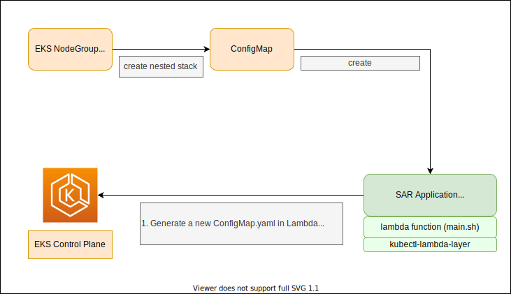

# auto-cm-drainer-cfn
Test for auto-configmap and auto-drainer through CFN


This sample walks you through building a cloudformation custom resource that allows you customize your hook in AWS Lambda.


## Steps

1. build your own `aws-lambda-layer-kubectl`
2. customize your `eks-auth-hook` lambda function custom runtime with the `aws-lambda-layer-kubectl`
3. publish your `eks-auth-hook` lambda function as a public or private SAR Application
4. specify the SAR Application ARN and Version in the `test-auto-cm.yaml`


## Architecture




## build your `aws-lambda-layer-kubectl`

```bash
git clone https://github.com/aws-samples/aws-lambda-layer-kubectl.git kubectl-layer
cd kubectl-layer
make layer-build sam-layer-package sam-layer-deploy
```
Response
```
Successfully created/updated stack - eks-kubectl-layer-stack in ap-northeast-1

# print the cloudformation stack outputs
[
    {
        "OutputKey": "LayerVersionArn",
        "OutputValue": "arn:aws:lambda:ap-northeast-1:903779448426:layer:eks-kubectl-layer:35",
        "Description": "ARN for the published Layer version",
        "ExportName": "LayerVersionArn-eks-kubectl-layer-stack"
    }
]
[OK] Layer version deployed.
```

copy the `OutputValue`, which represents your `aws-lambda-layer-kubectl` layer version arn.


## custom your `eks-auth-hook` lambda function

You can customize your business logic in `func.d/main.sh`. Make sure you update `Makefile` before moving to the next step.

```bash
cd eksAuthUpdateHook
#  update the Makefile:
# `S3BUCKET`: a temp s3 bucket for assets staging, make sure you have read/write permission 
# `LAMBDA_LAYER_KUBECTL_ARN`: the kubectl arn we just built and deployed
# `LAMBDA_ROLE_ARN`: the EKS amdin role arn with `aws eks describe-clusters` privileges
#
# update func.d/main.sh to customize your business logic
```


## publish the lambda function as a SAR Application with the kubectl layer

```bash
make sam-package sam-deploy
```

click the returned URL and copy the ARN of the SAR Applicaiton

e.g. `arn:aws:serverlessrepo:ap-northeast-1:903779448426:applications/eks-auth-update-hook-demo`

copy the version number (e.g. `1.0.0`)


## specify the ARN and Version in the `test-auto-cm.yaml`

As our custom SAR App is ready, we can pass the SAR ApplicatonId and SementicVersion as `EksAuthUpdateApplicationId` and `EksAuthUpdateApplicationSemanticVersion` in the `test-auto-cm.yaml`. Behind the scene, the `test-auto-cm.yaml` will pass parameters to the EksAuthUpdateHook SAR App, which passwd to the lambda function and you can customize your business logic with shell script(`main.sh`) in the lambda function.
